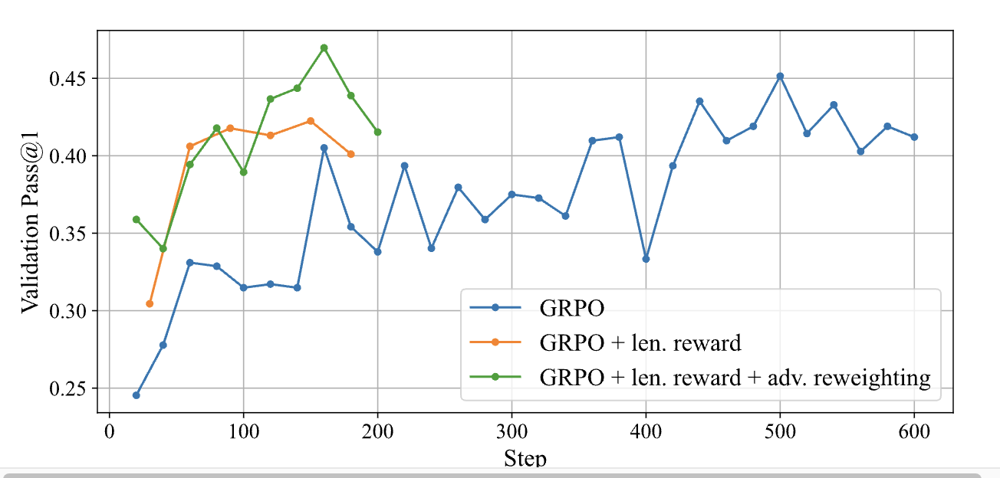

<div align="center">

# GRPO-LEAD 

[](https://huggingface.co/PlanePaper/LEAD-14B)
[](https://huggingface.co/datasets/PlanePaper/GRPO-LEAD-SFTData)
[](https://arxiv.org/abs/2504.09696)

</div>


## Overview

**GRPO-LEAD** (**GRPO** with **L**ength-dependent rewards, **E**xplicit penalties, and **A**dvantage reweighting for **D**ifficulty) is a reinforcement learning pipeline for fine-tuning LLMs for more concise and accurate reasoning in mathematical tasks.

**Our work builds upon and extends the [DeepScaler](https://github.com/agentica-project/rllm) framework — many of our components, including data preprocessing and training scripts, are adapted or extended from it.**


**Figure 1**: Validation Pass@1 over training steps for three configurations: GRPO, GRPO with length reward, and GRPO with length reward plus advantage reweighting.

---

## Getting Started 🔧

### Installation

```
# Installing Python 3.10 Environment.
conda create -n grpo-lead python=3.10 -y
conda activate grpo-lead

# Installing grpo-lead dependencies.
cd grpo-lead
pip install -e ./verl
pip install -e .
```

---
## Dataset 📦

We release [**GRPO-LEAD-SFTData**](https://huggingface.co/datasets/PlanePaper/GRPO-LEAD-SFTData), a collection of **12,153** high-quality math problems generated by [**QwQ-32B**](https://huggingface.co/Qwen/QwQ-32B), primarily sourced from [DeepScaler](https://github.com/agentica-project/rllm) with difficulty > 1.

It serves as the training backbone for GRPO-LEAD’s stage-1 SFT and we use [**LLaMA Factory**](https://github.com/hiyouga/LLaMA-Factory) to conduct the SFT stage.

## Data 📊

**Raw training data is in the directory:**

```
grpo-lead/data/train/
```

**The data preprocessing notebook is located at, you can process the dataset on your own:**

```
grpo-lead/data/preprocess/data_preprocess.ipynb
```

**To convert raw `.json` data into `.parquet` format for training, use the following script**:

```
python scripts/data/process_dataset.py
```

---

## Training Scripts

**Training script used for the main experiments:**

```
scripts/train/ds_14b_sft_stage1.sh
```

---

## Results 📈

We evaluate our model with AIME24/25,  all evaluation are conducted with 14k max tokens, 0.6 temperature and 0.01 min-p with 32 samples per question. 

| **Model Name**   | **AIME24 Cons@32** | **AIME24 Pass@1** | **AIME24 Len_avg** | **AIME25 Cons@32** | **AIME25 Pass@1** | **AIME25 Len_avg** |
|:----------------:|:------------------:|:------------------:|:------------------:|:------------------:|:------------------:|:------------------:|
| **DeepSeek-Distilled-14B** | 0.800              | 0.614              | 9182               | 0.633              | 0.429              | 10046              |
| **Light-R1-14B** | 0.833              | 0.641              | 9571               | 0.767              | 0.505              | 10194              |
| **LEAD-14B-stage1**  | 0.833              | 0.629              | 8790               | 0.767              | 0.523              | 9371               |
| **LEAD-14B-stage3**  | 0.867              | 0.650              | 8267               | 0.767              | 0.539              | 8668               |

## Citation 📖

If you find our work useful, please cite it as:

```bibtex
@misc{zhang2025grpoleaddifficultyawarereinforcementlearning,
      title={GRPO-LEAD: A Difficulty-Aware Reinforcement Learning Approach for Concise Mathematical Reasoning in Language Models}, 
      author={Jixiao Zhang and Chunsheng Zuo},
      year={2025},
      eprint={2504.09696},
      archivePrefix={arXiv},
      primaryClass={cs.CL},
      url={https://arxiv.org/abs/2504.09696}, 
}
```
